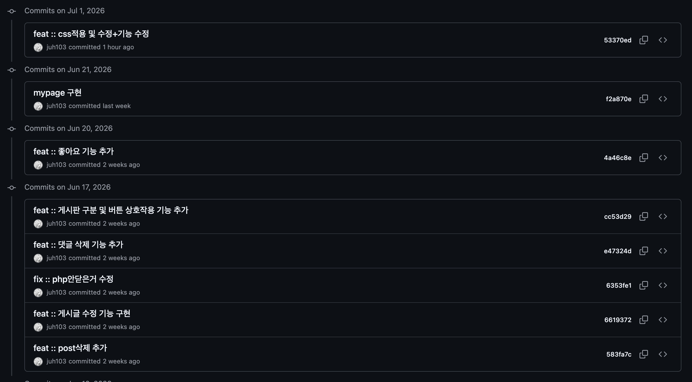
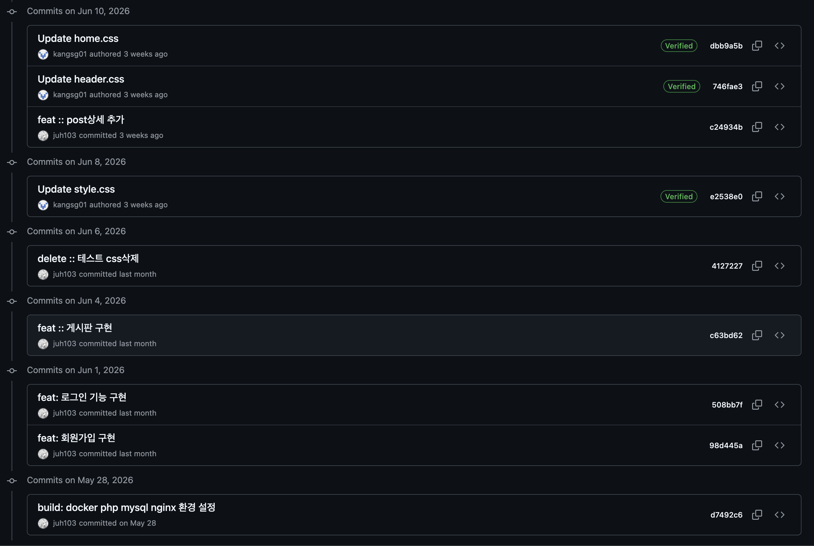

# team-1-9--project
### 프로젝트 제목 및 설명
팀원 : 1301 강승곤, 1309 김준호
프로젝트 이름 : 익명고민상담소
주제 선정 이유 : 익명으로 고민을 올리면 조금 더 진심으로 고민을 작성하지 않을까 해서 이 주제를 선정했고, 자유게시판도 존재해서 익명으로 활동할 수 있다.  
### 프로젝트 구조 설명
```
team-1-9--project/
 ┃
 ┣ mysql
 ┃ ┗ init.sql
 ┣ nginx
 ┃ ┗ default.conf
 ┣ php
 ┃ ┣ Dockerfile
 ┃ ┗ php.ini
 ┣ src
 ┃ ┣ css
 ┃ ┃ ┣ board.css
 ┃ ┃ ┣ header.css
 ┃ ┃ ┣ home.css
 ┃ ┃ ┗ style.css
 ┃ ┣ pages
 ┃ ┃ ┣ board.php
 ┃ ┃ ┣ check_id.php
 ┃ ┃ ┣ component_footer.php
 ┃ ┃ ┣ component_header.php
 ┃ ┃ ┣ component_hero.php
 ┃ ┃ ┣ component_stats.php
 ┃ ┃ ┣ component_top_posts.php
 ┃ ┃ ┣ db.php
 ┃ ┃ ┣ delete_comment.php
 ┃ ┃ ┣ delete_post.php
 ┃ ┃ ┣ edit_post.php
 ┃ ┃ ┣ footer.php
 ┃ ┃ ┣ header.php
 ┃ ┃ ┣ index.php
 ┃ ┃ ┣ like_post.php
 ┃ ┃ ┣ login.php
 ┃ ┃ ┣ logout.php
 ┃ ┃ ┣ mypage.php
 ┃ ┃ ┣ notice.php
 ┃ ┃ ┣ notice_delete.php
 ┃ ┃ ┣ notice_edit.php
 ┃ ┃ ┣ notice_view.php
 ┃ ┃ ┣ post.php
 ┃ ┃ ┣ register.php
 ┃ ┃ ┗ write.php
 ┃ ┗ .DS_Store
 ┣ .DS_Store
 ┣ .gitignore
 ┣ README.md
 ┗ docker-compose.yml
 ```
### 기능
1. 로그인 & 회원가입 기능
* 회원가입할때 실명을 요구하는게 아닌 아이디와 유저가 직접 정한 익명 닉네임을 사용하여 익명성을 보장함, 로그인 기능은 평범함
2. 고민 게시판
* 게시글 검색 & 카테고리 & 글쓰기 기능을 구현.
* 실제 DB와 연동하여 작성된 게시글이 게시판에 보이게 함
3. 자유 게시판
* 게시글 검색 & 글쓰기 기능 구현
* 원하고 싶은 글 작성가능
4. 공지사항
* 관리자 계정으로만 작성가능
* 업데이트 or 수정된 기능 공지
5. 메인 페이지
* 좋아요 기반 지금, 인기 있는 고민 TOP 3를 보여준다
* 하루동안 올라온 고민의 통계를 보여준다

### 기여 방법



### 어려웠던 점 및 해결 방법
docker compose -d --build 할때마다 mysql이 새로 다운되서 데이터베이스가 날아가는 문제가 발생함 docker compose 파일에서 mysql에 볼륨설정을 하여 문제를 해결함.

### 커밋 컨벤션

| Type       | Description                                      |
|------------|--------------------------------------------------|
| **feat**   | 새로운 기능 추가                                  |
| **fix**    | 버그 수정                                        |
| **refactor** | 코드 리팩토링 (기능 변경 없이 구조 개선)           |
| **test**   | 테스트 코드 작성                                  |
| **chore**  | 기타 자잘한 작업 (빌드 설정, 패키지 관리 등)        |
| **docs**   | 문서 추가 또는 수정                               |
| **delete** | 불필요한 코드나 파일 삭제                         |
| **build**  | 빌드 관련 파일 및 설정 변경                        |

---

### 커밋 메시지 형식1
- **형식**: `타입(#이슈번호) :: 변경 사항 요약`
- **제목**은 50자 이내, **본문**은 선택적이지만 72자 이내로 요약 설명 권장.

---